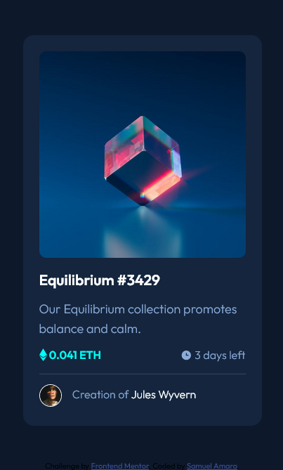

# Frontend Mentor - NFT preview card component solution

This is a solution to the [NFT preview card component challenge on Frontend Mentor](https://www.frontendmentor.io/challenges/nft-preview-card-component-SbdUL_w0U). Frontend Mentor challenges help you improve your coding skills by building realistic projects. 

## Table of contents

- [Overview](#overview)
  - [The challenge](#the-challenge)
  - [Screenshot](#screenshot)
  - [Links](#links)
- [My process](#my-process)
  - [Built with](#built-with)
  - [What I learned](#what-i-learned)
  - [Useful resources](#useful-resources)
- [Author](#author)

## Overview

### The challenge

Users should be able to:

- View the optimal layout depending on their device's screen size
- See hover states for interactive elements

### Screenshot



### Links

- Solution URL: [Add solution URL here](https://your-solution-url.com)
- Live Site URL: [Add live site URL here](https://your-live-site-url.com)

## My process

### Built with

- Semantic HTML5 markup
- CSS custom properties
- Property layout - float
- Property layout - display

### What I learned

In this project as a learning experience I learned to create an overlay over an image, using pure css

```css
.conteiner-img{
    position: relative;
    overflow: auto;
}

.overlay{
    position: absolute;
    top: 0;
    left: 0;
    bottom: 3px;
    border-radius: 10px;
    width: 100%;
    height: 99%;
    background-color: hsla(178, 100%, 50%, 0.6);
    visibility: hidden;
    z-index: 1;
}

.overlay img{
    position: absolute;
    display: block;
    padding: 43%;
}
```

### Useful resources

- [style image](https://www.w3schools.com/css/css3_images.asp) - This helped me understand how to overlay an image.

## Author

- Website - [Samuel Amaro](https://github.com/Samuel-Amaro)
- Frontend Mentor - [@Samuel-Amaro](https://www.frontendmentor.io/profile/Samuel-Amaro)

